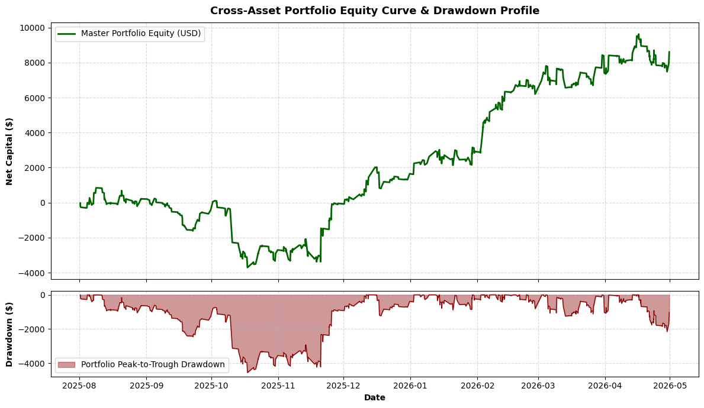

# Quantitative Systematic Trading Architecture

## Overview
This repository contains the performance analytics and architectural documentation for a proprietary multi-asset trading engine. The core execution logic is built in C# (NinjaTrader 8), utilizing quantitative regime-switching models and statistical variance bands to trade highly liquid global futures (MNQ, MES, MGC). 

Due to IP protection, raw execution source code is kept private. This repository showcases the mathematical architecture, risk-management protocols, and Python-based performance tearsheets (Pandas/Matplotlib) used to validate the models out-of-sample.

## Core Strategy Engines

* **High-Beta Volatility Engine (Robust Trend-Pullback):** Designed to exploit intraday volatility expansions on the Nasdaq-100. It utilizes an adaptive SMA/ADX regime filter to confirm momentum continuation and relies on delayed volatility trailing stops to capture massive right-tail outliers.
* **Asymmetric Statistical Mean Reversion (Quant Regime Scalper):** A volatility-gated statistical arbitrage model deployed across a multi-asset portfolio (S&P 500, Nasdaq, and Gold). It mathematically approximates market regimes via an ATR compression ratio (`fastAtr / regimeAtr`), fading extreme Z-Score deviations exclusively during mean-reverting macro states.
* **Universal Expansion Engine:** A pure asymmetric breakout model capturing transitions from low to high-volatility regimes. It pairs ATR contraction patterns with a one-way High-Water Mark trailing stop to ride massive momentum outliers.

## Risk Management Architecture
The system employs strict, institutional-grade risk parameters:
* **Dynamic Position Sizing:** Volatility-adjusted position sizing using fractional Kelly criterion formulas to maximize capital growth while capping ruin probability.
* **Portfolio Risk Budgeting:** Hard-coded daily loss limits and maximum trailing drawdowns enforced at the portfolio level.
* **Microstructure Invalidation:** Trailing stops tied to ATR expansion and structural market breaks, rather than arbitrary tick counts.

## Analytics Pipeline
The included Python notebooks ingest raw execution logs (CSV) to calculate institutional metrics:
* Sharpe & Sortino Ratios
* Maximum Peak-to-Trough Drawdown
* Expectancy and Profit Factors

---

## Verified Performance Analytics (Out-of-Sample)

### 1. Master Cross-Asset Portfolio (Asymmetric Mean Reversion)
*This tearsheet aggregates the out-of-sample executions of the Asymmetric Mean Reversion engine applied across three distinct asset classes, proving the model's structural edge is not over-optimized to a single market.*

**Architecture:** Volatility-Gated Statistical Arbitrage (Z-Score Variance / ATR Regime Filter)  
**Validation:** Rolling Walk-Forward Optimization (Stitched Out-of-Sample)

| Metric | Out-of-Sample Result |
| :--- | :--- |
| **Total Stitched PnL** | **$3,956.00** |
| **Portfolio Profit Factor** | **1.26** |
| **Estimated Sharpe Ratio** | **2.68** |
| **Win Rate** | **57.58%** |
| **Max Peak-to-Trough Drawdown** | **-$1,546.80** |
| **Total Out-of-Sample Executions** | **198 trades** |
| **Unique Assets Traded** | **3 (MNQ, MES, MGC)** |

.png)

---

### 2. Standalone Anchor: High-Beta Nasdaq Volatility Engine 
*This engine acts as the portfolio's offensive anchor, capturing massive right-tail outliers during aggressive Nasdaq momentum regimes.*

**Architecture:** Robust Trend-Pullback Model (SMA / ADX Regime Filter)  
**Instrument:** Micro E-mini Nasdaq-100 (MNQ) — 3-Minute Timeframe  
**Validation:** Rolling Walk-Forward Optimization (30-day train / 15-day out-of-sample test)

| Metric | Out-of-Sample Result |
| :--- | :--- |
| **Total Stitched PnL** | **$3,415.00** |
| **Profit Factor** | **1.19** |
| **Estimated Sharpe Ratio** | **1.55** |
| **Trade Expectancy (Avg Trade)** | **$11.98** |
| **Win Rate** | **28.07%** |
| **Max Peak-to-Trough Drawdown** | **-$2,800.70** |
| **Total Out-of-Sample Executions** | **285 trades** |

_oos.png)

---

### 3. Standalone Anchor: Universal Expansion Engine
*This model is engineered to survive low-win-rate environments by heavily restricting losses and letting ATR-driven trailing stops maximize right-tail momentum spikes.*

**Architecture:** Volatility Expansion Breakout (Dynamic ATR Trailing Stop / High-Water Mark)  
**Instrument:** Micro E-mini Nasdaq-100 (MNQ) — 1000 Volume Timeframe  
**Validation:** 8-Month Out-of-Sample Historical Backtest (Live-Tested Parameter Template)

| Metric | Out-of-Sample Result |
| :--- | :--- |
| **Total Net Profit** | **$8,608.50** |
| **Profit Factor** | **1.23** |
| **Estimated Sharpe Ratio** | **1.76** |
| **Trade Expectancy (Avg Trade)** | **$10.01** |
| **Win Rate** | **25.35%** |
| **Max Peak-to-Trough Drawdown** | **-$4,553.20** |
| **Total Out-of-Sample Executions** | **860 trades** |

